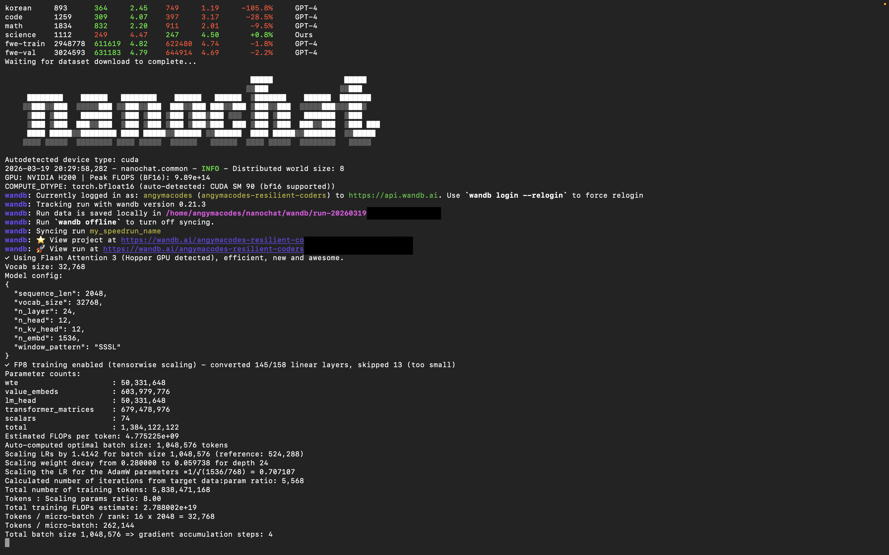

# Nanochat
This repository contains the saved model artifacts from a successful Nanochat training run completed on Nebius using H100 GPUs.

# Overview
This model represents a full Nanochat training run that was successfully completed, validated, and preserved. The weights of this project were trained using a minimal GPT-style training pipeline inspired by Andrej Karpathy's NanoChat project. The goal of this project is to provide lightweight, reproducible language model training and inference. After training finished, I was able to launch the browser-based chat interface, confirm the model loaded correctly, and back up the final checkpoint files. Note that the tokenizer and token byte files were not saved in this run.

Ultimately, this project was more than just training a model. It was an opportunity for me to complete the full workflow from setup and execution to validation and preservation of the final artifacts. This makes the run particularly meaningful, as it reflects a cleaner and more complete outcome compared to an earlier attempt where the training stopped abruptly halfway through the process.

The training process followed the NanoChat setup and speedrun workflow, including:

- Model initialization and configuration
- Tokenization and dataset preparation
- Training loop with gradient updates
- Checkpointing and weight export

# Screenshots
### First Look 

### Training Run

# Files Included
- model_000483.pt — main model weights
- meta_000483.json — training metadata (config, step info, etc.)
- optim_000483_rank*.pt — optimizer shards (used for resuming training)

### Usage Note
This repo does NOT include tokenizer files.

# Training Context
The run was executed on a Nebius GPU VM using the official Nanochat speedrun workflow.

# Intended Use
Experimentation with small language models
Fine-tuning and research

# Companion Repo: HuggingFace
https://huggingface.co/divergurl/nanochat-d24-nebius